# Food Safety Violation Detection - Microservices Architecture

## System Overview
This document describes the microservices architecture for our food safety violation detection system that monitors hand hygiene compliance in food preparation areas.

## Architecture Flow Diagram

```mermaid
graph TB
    %% Input Sources
    VideoFile[📹 Video File<br/>MP4/AVI/MOV]
    RTSPFeed[📡 RTSP Camera Feed<br/>Live Stream]
    
    %% Frame Reader Service
    FrameReader[🖼️ Frame Reader Service<br/>- OpenCV<br/>- Extract frames from video<br/>- Add timestamps<br/>- Resize/preprocess frames]
    
    %% Message Broker
    MessageBroker[📨 Message Broker<br/>Kafka<br/>- Frame buffering<br/>- Stream management<br/>- Topic: video_frames]
    
    %% Detection Service
    DetectionService[🔍 Detection Service<br/>- Object detection model<br/>- ROI analysis<br/>- Violation logic<br/>- Hand + Scooper detection]
    
    %% Database
    Database[(🗄️ Database<br/>- Violation records<br/>- Frame paths<br/>- Bounding boxes<br/>- Timestamps<br/>- Metadata)]
    
    %% Streaming Service
    StreamingService[🌐 Streaming Service<br/>FastAPI<br/>- REST API endpoints<br/>- WebSocket/WebRTC<br/>- MJPEG streaming]
    
    %% Frontend
    Frontend[💻 Frontend UI<br/>React/Vue/HTML<br/>- Live video display<br/>- Violation alerts<br/>- ROI visualization<br/>- Statistics dashboard]
    
    %% User Interaction
    User[👤 User<br/>- Define ROIs<br/>- Monitor violations<br/>- View statistics]
    
    %% Data Flow
    VideoFile --> FrameReader
    RTSPFeed --> FrameReader
    
    FrameReader -->|Publish frames| MessageBroker
    MessageBroker -->|Subscribe to frames| DetectionService
    
    DetectionService -->|Save violations| Database
    DetectionService -->|Send results| StreamingService
    
    StreamingService -->|REST API<br/>/violations/count<br/>/violations/list| Frontend
    StreamingService -->|WebSocket/WebRTC<br/>Live video + detections| Frontend
    
    Database -->|Query violations| StreamingService
    
    Frontend --> User
    User -->|Configure ROIs| Frontend
    Frontend -->|ROI settings| StreamingService
    StreamingService -->|ROI config| DetectionService
    
    %% Violation Detection Logic
    subgraph "🚨 Violation Detection Logic"
        ViolationLogic["""
        For each frame:
        1. Detect objects (hand, scooper, pizza, human)
        2. Check if hand enters ROI (protein cargo)
        3. Track hand movement and ingredient pickup
        4. Verify scooper usage
        5. If hand → ingredient → pizza WITHOUT scooper:
           ❌ LOG VIOLATION
        6. If hand → scooper → ingredient → pizza:
           ✅ NO VIOLATION
        """]
    end
    
    DetectionService -.-> ViolationLogic
    
    %% Message Topics/Channels
    subgraph "📡 Message Broker Topics"
        Topics["""
        • video_frames
        • detection_results
        • violation_alerts
        • roi_updates
        """]
    end
    
    MessageBroker -.-> Topics
    
    %% API Endpoints
    subgraph "🔌 REST API Endpoints"
        APIs["""
        GET /violations/count
        GET /violations/list
        GET /violations/statistics
        POST /roi/configure
        GET /stream/metadata
        WebSocket: /stream/live
        """]
    end
    
    StreamingService -.-> APIs
    
    %% Styling
    classDef serviceBox fill:#e1f5fe,stroke:#01579b,stroke-width:2px
    classDef dataStore fill:#f3e5f5,stroke:#4a148c,stroke-width:2px
    classDef userInterface fill:#e8f5e8,stroke:#1b5e20,stroke-width:2px
    classDef inputSource fill:#fff3e0,stroke:#e65100,stroke-width:2px
    
    class FrameReader,DetectionService,StreamingService serviceBox
    class MessageBroker,Database dataStore
    class Frontend,User userInterface
    class VideoFile,RTSPFeed inputSource
```

## Service Descriptions

### 🖼️ Frame Reader Service
- **Purpose**: Extract frames from video sources (files or RTSP streams)
- **Technologies**: OpenCV
- **Output**: Preprocessed frames with timestamps to message broker

### 📨 Message Broker
- **Purpose**: Asynchronous communication between services
- **Options**: Apache Kafka 
- **Features**: Frame buffering, stream management, topic-based messaging

### 🔍 Detection Service
- **Purpose**: AI-powered object detection and violation analysis
- **Features**: 
  - Hand and scooper detection
  - ROI (Region of Interest) monitoring
  - Violation logic implementation
  - Database logging

### 🌐 Streaming Service
- **Purpose**: API and real-time streaming server
- **Technologies**: FastAPI
- **Features**:
  - REST API for violation statistics
  - WebSocket/WebRTC for live video streaming
  - ROI configuration management

### 💻 Frontend UI
- **Purpose**: User interface for monitoring and configuration
- **Technologies**: Canvas/HTML
- **Features**:
  - Live video display with detection overlays
  - Violation alerts and statistics
  - ROI configuration interface

## Violation Detection Logic

The system implements the following logic for detecting violations:

1. **Object Detection**: Identify hands, scoopers, pizza, and ingredients in each frame
2. **ROI Monitoring**: Track when hands enter critical zones (protein cargo area)
3. **Movement Tracking**: Follow hand movements and ingredient pickup actions
4. **Scooper Verification**: Check if a scooper is used during ingredient handling
5. **Violation Classification**: 
   - ❌ **VIOLATION**: Hand → Ingredient → Pizza (without scooper)
   - ✅ **COMPLIANT**: Hand → Scooper → Ingredient → Pizza

## Deployment Architecture

Each microservice can be containerized using Docker and deployed independently:

- **Scalability**: Services can be scaled based on demand
- **Fault Tolerance**: Service failures don't affect the entire system
- **Technology Flexibility**: Each service can use different technologies/languages
- **Maintenance**: Services can be updated independently

## API Endpoints

The Streaming Service provides the following REST API endpoints:

- `GET /violations/count` - Get total violation count
- `GET /violations/list` - Get detailed violation records
- `GET /violations/statistics` - Get violation analytics
- `POST /roi/configure` - Configure ROI zones
- `GET /stream/metadata` - Get stream information
- `WebSocket: /stream/live` - Live video streaming with detections
